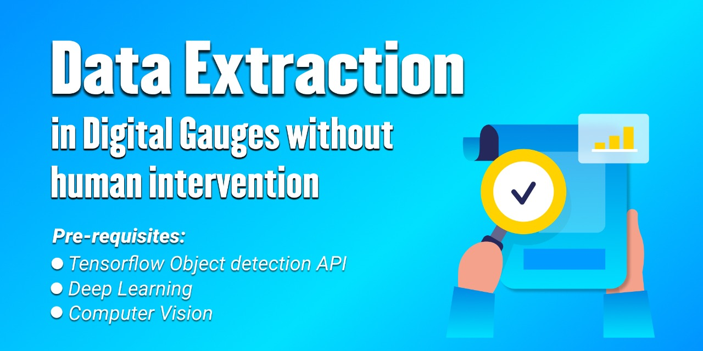
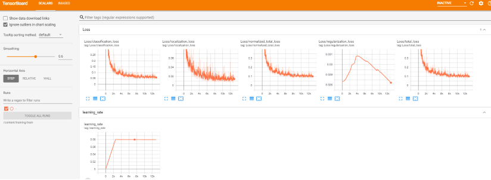

## This repository drives you through,Real-world-Data-Extraction-in-Digital-Guages-using-Computer-vision-and-Tensorflow through webcam.

## Custom Trained Object Detection model for extracting the data in digital gauges.

## Project Scope:
The aim of the project is  to capture data from digital gauges without any  human intervention. We focused mainly on digital gauges. 
The idea is to build a computer vision model that would capture the data and store its readings in particular files for future tracking.

## Idea and Approach:
* Tried different approaches in order to satisfy the objective like used ocr space api ,but ocr space api did not perform well on seven segment display images.
* So the final method tried to reach the objective is Object detection.
* Object detection will take an image and identify and label specific objects within the image. For a complex image with multiple objects in view, object detection will provide a bounding box around each detected object, as well as a label identifying the class to which the object belongs. So made a custom object detection model using tensorflow object detection api which recognizes shown numbers as objects and performs its detections showing accuracy and class of the shown digits.

* Making a Custom object detection model using Tensor Flow Object Detection Api which recognizes shown numbers as objects and performs its detections showing accuracy and class of the shown digits.
* Considering every digit and point as an object shown in the image ,labelling it with respected class and Training a custom trained object detection model using the best suited pretrained Cnn architecture which gives accurate results.

## Data peparation:
* Data preparation is the most important part of training your own model. Since we’re going to train a custom object detector, we must collect pictures of them! About 100 of them would be sufficient.

* Here are some of the example images which I have used for training and testing.

### Labelling:
* Once you’ve collected all the images you need, you need to label them manually. There are many packages that serve this purpose. labelImg is a popular choice.
* labelImg provides a user-friendly GUI. Plus, it saves label files (.xml) in the popular Pascal VOC format.
* check that every image has a corresponding .xml file and save them in a particular training and testing directory.
* The next step is creating a label map(.pbxt) for the classes.Classes need to be listed in the label map as shown in the below pitcure.

### Convert XML to CSV file.
* You can use my python script from the repository to convert XML files to CSV. 
* As we have all images and their bounding boxes are in XML format. Also all image has separate XML file so using the xml_to_csv.py, we are creating a CSV file which contains all the XML files and their bounding box co-ordinates to single CSV file which is input for creating TFrecords.

### Create TFRecord
* TFRecord is an important data format designed for Tensorflow.
* Before you can train your custom object detector, you must convert your data into the TFRecord format.

###  Download pre-trained model
* There are many pre-trained object detection models available in the model zoo. 
* In order to train them using our custom data set, the models need to be restored in Tensorflow using their checkpoints (.ckpt files), which are records of previous model states.
* For this Project I have used efficientdet_d0_coco17_tpu-32 here and saved its model checkpoint files (ckpt.meta, ckpt-0.index, ckpt-0.data-00000-of-00001) to our models/checkpoints/ directory.
## Design and Architecure of the model:
* Using EfficientDet Object detection model (SSD with EfficientNet-b0 + BiFPN feature extractor, shared box predictor and focal loss), trained on COCO 2017 dataset.

EfficientNet as the backbone network, BiFPN as the feature network, and shared class/box prediction network. Both BiFPN layers and class/box net layers are repeated multiple times based on different resource constraints

* Compound scaling
* BIFPN network 
* Box/class prediction network
* Input image resolution  

### Modify Config (.config) File
* Each of the pretrained models has a config file that contains details about the model. 
* To detect our custom class, the config file needs to be modified accordingly.

## Training and Evaluation:
* Custom Dataset,Images used for training 70 and for validation ,testing 30 images were used.
* Optimizer-Momentum optimizer
* momentum_optimizer_value: 0.9
* Batch size :16
* total_steps: 30000 ,warmup_learning_rate: .001,warmup_steps: 2500
* learning_rate_base: 8e-2
* Evaluation can be run in parallel with training. 
* You can visualize model training progress using Tensorboard.
* Based on the graphs output by Tensorboard, you may decide when you want to stop training. 
* Usually, you may stop the process when the loss function is tapering off and no longer 
  decreasing by a significant amount. In my case, I stopped at step 12592.
*  Tensor Board Loss view:

 

 
                                                            
## Model exporting
* Once you finish training your model, you can export your model to be used for inference.

## Execution:
* The object_detection_tutorial.ipynb notebook walks you through the process of using a pre-trained model to detect objects in an image.
To try it out, I recommend to run it inside Google Colab.

## Classify images 
Now our custom model will be ready,we can use it to detect data in pictures ,videos and through webcam.

## Prerequisites:
* Anaconda Python 3.7 (Optional)
* Go to https://www.anaconda.com/products/individual and click the “Download” button ,Download the Python 3.7 64-Bit Graphical Installer
  or the 32-Bit Graphical Installer installer, per your system requirements.
* Run the downloaded executable (.exe) file to begin the installation.
* In the next step, check the box “Add Anaconda3 to my PATH environment variable”.
* This will make Anaconda your default Python distribution, which should ensure that you have the same default Python distribution across all editors.
* GPU Support (Optional)
* Nvidia GPU (GTX 650 or newer)
* CUDA Toolkit v10.1
* CuDNN 7.6.5
* Go to https://developer.nvidia.com/rdp/cudnn-download
* Create a user profile if needed and log in ,Select cuDNN v7.6.5 (Nov 5, 2019), for CUDA 10.1
  Download cuDNN v7.6.5 Library for Windows 10.
* Extract the contents of the zip file (i.e. the folder named cuda) inside <INSTALL_PATH>\NVIDIA GPU Computing Toolkit\CUDA\v10.1\, where <INSTALL_PATH> points to the   installation directory specified during the installation of the CUDA Toolkit. By default <INSTALL_PATH> = C:\Program Files.
* Go to Start and Search “environment variables”
* Click “Edit the system environment variables”. This should open the “System Properties” window
* In the opened window, click the “Environment Variables…” button to open the “Environment Variables” window.
* Under “System variables”, search for and click on the Path system variable, then click “Edit…”
* Add the following paths, then click “OK” to save the changes:
* <INSTALL_PATH>\NVIDIA GPU Computing Toolkit\CUDA\v10.1\bin
* <INSTALL_PATH>\NVIDIA GPU Computing Toolkit\CUDA\v10.1\libnvvp
* <INSTALL_PATH>\NVIDIA GPU Computing Toolkit\CUDA\v10.1\extras\CUPTI\libx64
* <INSTALL_PATH>\NVIDIA GPU Computing Toolkit\CUDA\v10.1\cuda\bin
 

* Install TensorFlow 2.x,TensorFlow Object Detection API .

Install TensorFlow Model Garden for different pretrained models using the below link. https://github.com/tensorflow/models/blob/master/research/object_detection/g3doc/tf2_detection_zoo.md

Installing Anaconda, CUDA, and cuDNN.
Setting up the Object Detection directory structure and Anaconda Virtual Environment.
Gathering and labeling pictures.
Generating training data.
Creating a label map and configuring training.
Training.
Exporting the inference graph.
Testing and using your newly trained object detection classifier.
# To Do's:
1) Deploying the model into web application.
2) Should Try to use the webapp in real time.

 
