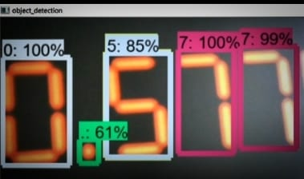
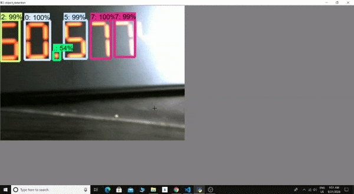

## DATA EXTRACTION IN DIGITAL GAUGES WITHOUT HUMAN INTERVENTION.

## Custom Trained Object Detection model for extracting the data in digital gauges.

## objective:
The aim of the project is  to capture data from digital gauges without any  human intervention. We focused mainly on digital gauges related to retail,automotive,Electrical,Thermal power,oil & gas-retail,boilers etc. The idea is to build a computer vision model that would capture the data and store its readings in particular files for future tracking.

## Summary:
Tried different approaches in order to satisfy the objective like used ocr space api ,but ocr space api did not perform well on seven segment display images.
So the final method tried to reach the objective is Object detection.
Object detection will take an image and identify and label specific objects within the image. For a complex image with multiple objects in view, object detection will provide a bounding box around each detected object, as well as a label identifying the class to which the object belongs. So made a custom object detection model using tensorflow object detection api which recognizes shown numbers as objects and performs its detections showing accuracy and class of the shown digits.

