## DATA EXTRACTION IN DIGITAL GAUGES WITHOUT HUMAN INTERVENTION.

## Custom Trained Object Detection model for extracting the data in digital gauges.

## Project Scope:
The aim of the project is  to capture data from digital gauges without any  human intervention. We focused mainly on digital gauges related to retail,automotive,Electrical,Thermal power,oil & gas-retail,boilers etc. The idea is to build a computer vision model that would capture the data and store its readings in particular files for future tracking.

## Ideas and Approaches:
* Tried different approaches in order to satisfy the objective like used ocr space api ,but ocr space api did not perform well on seven segment display images.
* So the final method tried to reach the objective is Object detection.
* Object detection will take an image and identify and label specific objects within the image. For a complex image with multiple objects in view, object detection will provide a bounding box around each detected object, as well as a label identifying the class to which the object belongs. So made a custom object detection model using tensorflow object detection api which recognizes shown numbers as objects and performs its detections showing accuracy and class of the shown digits.

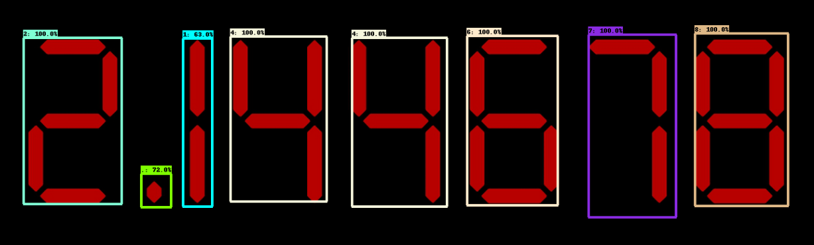
* Making a Custom object detection model using Tensor Flow Object Detection Api which recognizes shown numbers as objects and performs its detections showing accuracy and class of the shown digits.
* Considering every digit and point as an object shown in the image ,labelling it with respected class and Training a custom trained object detection model using the best suited pretrained Cnn architecture which gives accurate results.

## Data peparation:
* Data preparation is the most important part of training your own model. Since we’re going to train a custom object detector, we must collect pictures of them! About 100 of them would be sufficient.

* Here are some of the example images which I have used for training and testing.
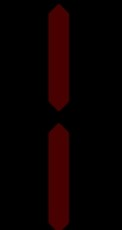
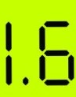
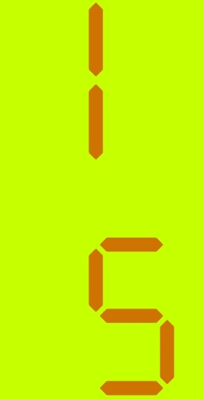

### Labelling:
* Once you’ve collected all the images you need, you need to label them manually. There are many packages that serve this purpose. labelImg is a popular choice.
* labelImg provides a user-friendly GUI. Plus, it saves label files (.xml) in the popular Pascal VOC format.
* check that every image has a corresponding .xml file and save them in a particular training and testing directory.
* The next step is creating a label map(.pbxt) for the classes.Classes need to be listed in the label map as shown in the below pitcure.

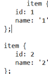

### Convert XML to CSV file.
* You can use my python script from the repository to convert XML files to CSV. 
* As we have all images and their bounding boxes are in XML format. Also all image has separate XML file so using the xml_to_csv.py, we are creating a CSV file which contains all the XML files and their bounding box co-ordinates to single CSV file which is input for creating TFrecords.

### Create TFRecord
* TFRecord is an important data format designed for Tensorflow.
* Before you can train your custom object detector, you must convert your data into the TFRecord format.

###  Download pre-trained model
* There are many pre-trained object detection models available in the model zoo. 
* In order to train them using our custom data set, the models need to be restored in Tensorflow using their checkpoints (.ckpt files), which are records of previous model states.

* For this Project I have used efficientdet_d0_coco17_tpu-32 here and saved its model checkpoint files (ckpt.meta, ckpt-0.index, ckpt-0.data-00000-of-00001) to our models/checkpoints/ directory.

### Modify Config (.config) File
* Each of the pretrained models has a config file that contains details about the model. 
* To detect our custom class, the config file needs to be modified accordingly.

## Design and Architecure:
* Using EfficientDet Object detection model (SSD with EfficientNet-b0 + BiFPN feature extractor, shared box predictor and focal loss), trained on COCO 2017 dataset.
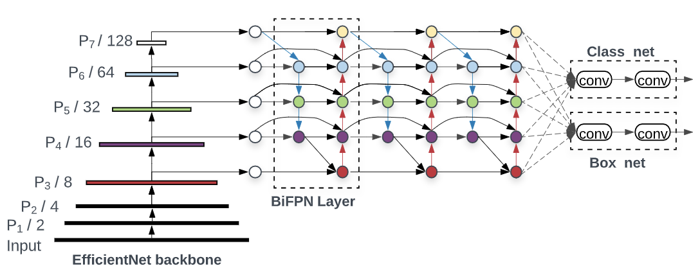

EfficientNet as the backbone network, BiFPN as the feature network, and shared class/box prediction network. Both BiFPN layers and class/box net layers are repeated multiple times based on different resource constraints

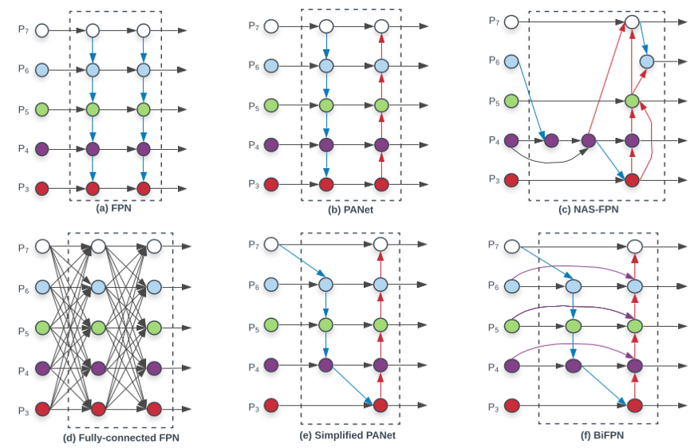
* Compound scaling
* BIFPN network 
* Box/class prediction network
* Input image resolution  
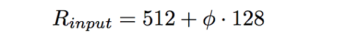

## Training and Execution:
* Custom Dataset
* Optimizer-Momentum optimizer
* momentum_optimizer_value: 0.9
* Batch size :16
* total_steps: 300000 ,warmup_learning_rate: .001,warmup_steps: 2500
* learning_rate_base: 8e-2
*  Tensor Board Loss view:

Localization Loss                 
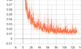 

Classification Loss
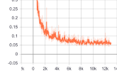

Normalized loss

Regularization loss
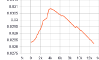

overall_loss
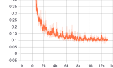

Learning_rate
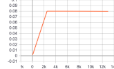

 
                                                            

 

## This readme describes every step required to get going with your own object detection classifier:

Installing Anaconda, CUDA, and cuDNN.
Setting up the Object Detection directory structure and Anaconda Virtual Environment.
Gathering and labeling pictures.
Generating training data.
Creating a label map and configuring training.
Training.
Exporting the inference graph.
Testing and using your newly trained object detection classifier.

 
